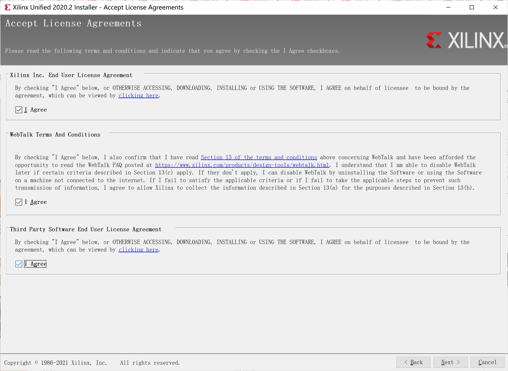
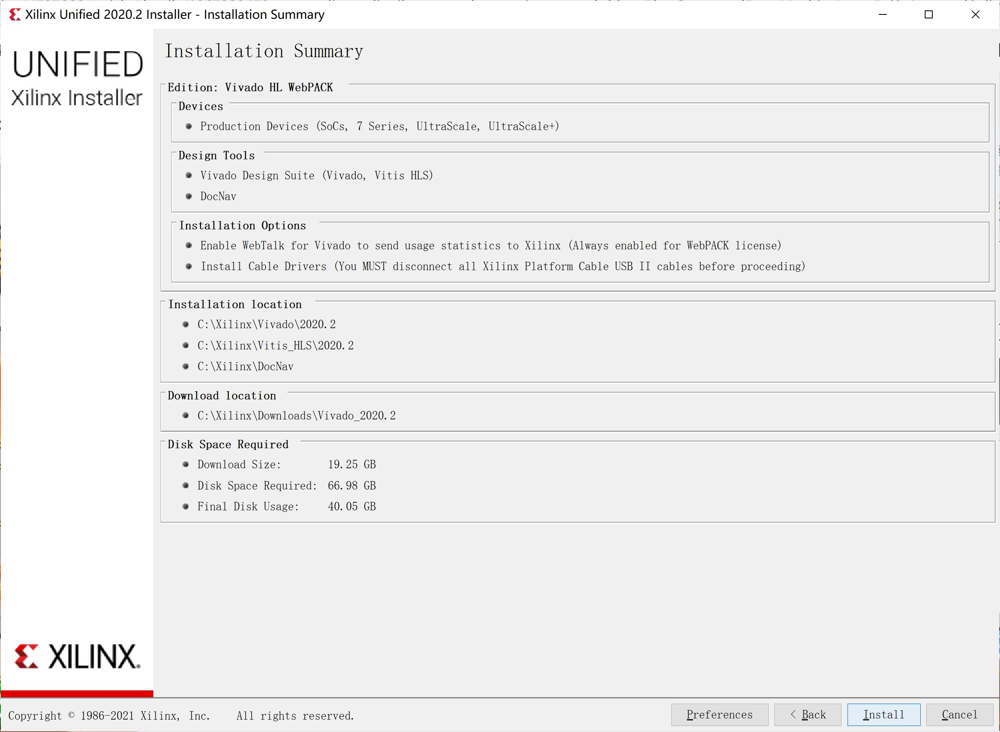

[notice]由于2015.4版本不支持4K分辨率，只能转向新版本。[/notice]

##软件下载
进入[下载地址](https://china.xilinx.com/support/download/index.html/content/xilinx/zh/downloadNav/vivado-design-tools/2020-2.html)后，下拉可以看见有三个下载地址

第一个 Xilinx Unified Installer 2020.2: Windows Self Extracting Web Installer，也是本文所采取下载方案。文件名已经写的很清楚，Web Installer，类似于鹅厂大型游戏的下载器

第三个 Vivado HLx 2020.2: All OS installer Single-File Download，单文件下载到本地后再安装

两者其实都可以，但是Single-File实在太大，下载时易受网络影响，故选择第一种方案，即下载的文件为`Xilinx_Unified_2020.2_1118_1232_Win64.exe`

**注意：在进行下载操作之前一定要注册好Xilinx的账号！**

##软件安装
1. 打开Installer后，等待进度条加载，进入Welcome界面，点击Next继续

2. 进入Select Install Type，填写好你的Xilinx注册的Email地址以及密码，选项默认

3. 选择安装的产品，这里选择第二个Vivado，第一个Vitis是Xilinx的下一代产品

4. 版本选择免费的webPACK，也就是第一个选项

5. 这里默认选项，不需要动

6. 勾选三个I Agree

7. 安装目录可自己选择，但是目录中不能含有中文！其余保持默认

8. 安装目录不存在，Yes创建

9. 总览安装配置，Install

10. 等待安装进程完成，大约两小时，安装好后会有一个弹窗，然后桌面上就会出现四个快捷方式，安装完毕！

Have a nice day！