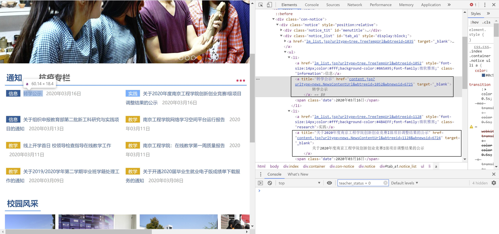
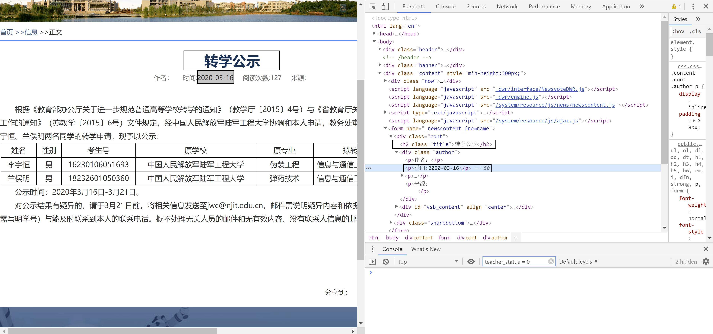
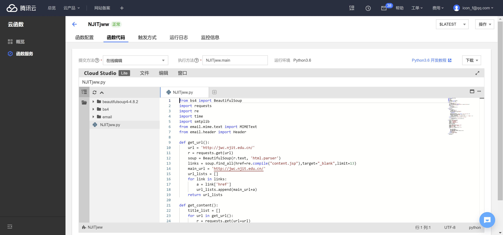
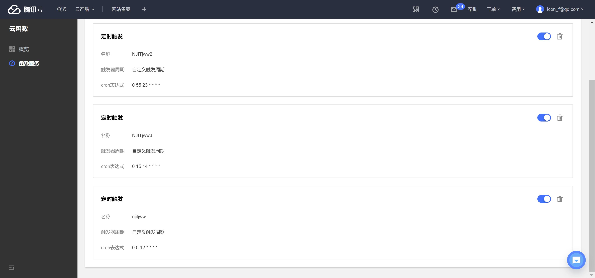

[notice]不想每天都点开教务网，又不想错过重要的信息，于是写了个简单的爬虫来偷懒[/notice]

##数据爬取
F12之后，发现内容页的url在这个标签里，但由于学校教务网前端做的花里胡哨，这里只能用正则表达式来抓取url

利用requests+beautifulsoup进行url的抓取并返回一个list:
```
def get_url():
    url = 'http://jwc.njit.edu.cn/'
    r = requests.get(url)
    soup = BeautifulSoup(r.text, 'html.parser')
    links = soup.find_all(href=re.compile("content.jsp"),target="_blank",limit=13)
    main_url = 'http://jwc.njit.edu.cn/'
    url_lists = []
    for link in links:
        a = link['href']
        url_lists.append(main_url+a)
    return url_lists
```
教务网平时也会对网站进行更新维护，limit的值要根据具体情况进行设定，url_lists里的元素也是

获取了文章的url之后，就是获取文章的标题和发布时间，于是继续F12

这两个值是很好获取的，但有的网页是需要内网权限的，没有title，注意排除此类干扰
```
def get_content():
    title_list = []
    for url in get_url():
        r = requests.get(url=url)
        r.encoding = 'utf-8'
        soup = BeautifulSoup(r.text, 'html.parser')
        titles = soup.find('h2', class_="title")
        if titles is None:
            continue
        title = titles.get_text()
        pub_data_text = soup.find('p',text=re.compile("\\d{4}-\\d{2}-\\d{2}")).text
```
其中`r.encoding = 'utf-8'`是为了防止出现中文乱码的问题

##邮件发送
代码实现：
```
import smtplib
from email.mime.text import MIMEText
from email.header import Header

def sent_email(mail_title,mail_body):
    sender = '**********'
    receiver = '*********'
    smtpServer = 'smtp.126.com'
    username = '*********'
    password = '*********'
    mail_title = mail_title
    mail_body = mail_body

    message = MIMEText(mail_body, 'plain', 'utf-8')
    message["Accept-Language"] = "zh-CN"
    message["Accept-Charset"] = "ISO-8859-1,utf-8"
    message['From'] = sender
    message['To'] = receiver
    message['Subject'] = Header(mail_title, 'utf-8')

    try:
        smtp = smtplib.SMTP()
        smtp.connect(smtpServer)
        smtp.login(username, password)
        smtp.sendmail(sender, receiver, message.as_string())
        print('邮件发送成功')
        smtp.quit()
    except smtplib.SMTPException:
        print("邮件发送失败！！！")

```
其中，`username`是你的邮箱账号，`password`是你的***SMTP授权码***

##定时执行
利用腾讯云云函数，轻松偷懒，具体配置如下：



关于定时触发器的设置，我的思路是：
学校一般在11：00-2：00这个时间段发通知，2：30的触发器保证了时效性，23：55的是防止遗漏

##全部代码实现：
```
from bs4 import BeautifulSoup
import requests
import re
import time
import smtplib
from email.mime.text import MIMEText
from email.header import Header

def get_url():
    url = 'http://jwc.njit.edu.cn/'
    r = requests.get(url)
    soup = BeautifulSoup(r.text, 'html.parser')
    links = soup.find_all(href=re.compile("content.jsp"),target="_blank",limit=13)
    main_url = 'http://jwc.njit.edu.cn/'
    url_lists = []
    for link in links:
        a = link['href']
        url_lists.append(main_url+a)
    return url_lists

def get_content():
    title_list = []
    for url in get_url():
        r = requests.get(url=url)
        r.encoding = 'utf-8'
        soup = BeautifulSoup(r.text, 'html.parser')
        titles = soup.find('h2', class_="title")
        if titles is None:
            continue
        title = titles.get_text()
        pub_data_text = soup.find('p',text=re.compile("\\d{4}-\\d{2}-\\d{2}")).text
        pub_data=pub_data_text.replace('时间:','')
        current_time = time.strftime('%Y-%m-%d', time.localtime())
        if pub_data == current_time:
            title_list.append(pub_data + " ； 今日通知：" + title + "；" + "详情点击： " + url)
    if len(title_list) == 0:
        sent_email(mail_title='今日没有通知',mail_body='今天没有通知')
    else:
        for title in title_list:
            sent_email(mail_title='今日通知',mail_body=title)
    title_list.clear()

def sent_email(mail_title,mail_body):
    sender = '**********'
    receiver = '*********'
    smtpServer = 'smtp.126.com'
    username = '*********'
    password = '*********'
    mail_title = mail_title
    mail_body = mail_body

    message = MIMEText(mail_body, 'plain', 'utf-8')
    message["Accept-Language"] = "zh-CN"
    message["Accept-Charset"] = "ISO-8859-1,utf-8"
    message['From'] = sender
    message['To'] = receiver
    message['Subject'] = Header(mail_title, 'utf-8')

    try:
        smtp = smtplib.SMTP()
        smtp.connect(smtpServer)
        smtp.login(username, password)
        smtp.sendmail(sender, receiver, message.as_string())
        print('邮件发送成功')
        smtp.quit()
    except smtplib.SMTPException:
        print("邮件发送失败！！！")

def main(self1,self2):
    get_content()
```

[项目地址](https://github.com/zhangshanbeng/NJITjww)←戳我